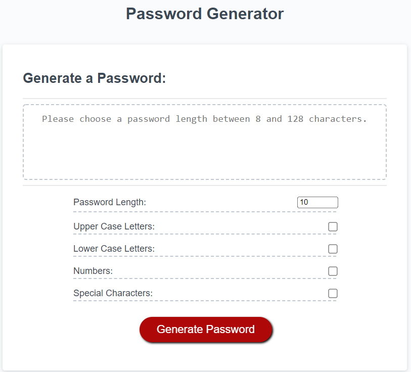

# Password Generator
--
Page live at: https://t-norm.github.io/password-generator/

This password generator uses Java Script to take infomration filled out on the webpage and returns a password that matches the requested criteria.
Please note that the script is coded to only accept passwords that are between 8-128 characters, as larger numbers cause the script to lag/are not 
neccessary, and low numbers are not very safe.
--

